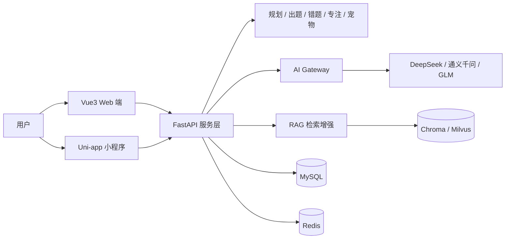

# AI智学管家

<p align="center">
  <strong>基于大模型的自适应学习平台</strong><br/>
  学习规划 → 知识学习 → 智能练习 → 错题反馈 → 行为激励
</p>

<p align="center">
  
  
  
  
  
  
  
  
</p>

## 项目简介

AI智学管家是一款面向高校学生的 AI 驱动型学习管理平台，利用大语言模型、RAG 检索增强和学习行为分析技术，解决传统学习工具“有工具无内容、有内容无规划、有规划无反馈”的问题。

项目围绕四大痛点：

1. 不知道学什么：AI 根据用户目标生成学习计划
2. 不知道怎么学：结合知识体系提供学习路径
3. 学完不会巩固：AI 生成针对性练习并管理错题
4. 难以坚持：通过专注管理和游戏化激励提高学习持续性

## 核心闭环



## 功能特性

| 模块 | 功能 | 状态 |
| --- | --- | --- |
| 用户系统 | 注册、登录、JWT、资料、账号注销与数据导出 | 骨架已完成 |
| 冷启动 | 1 分钟破冰问卷，专家模板 + AI 微调生成第一份计划 | 规划中 |
| AI 学习规划 | 周计划生成、难度梯度、Buffer、动态调整日志 | 骨架已完成 |
| 智能练习 | AI 出题、判题、四重质检、知识标签 | 骨架已完成 |
| 错题本 | 自动沉淀、艾宾浩斯复习调度、举一反三、用户反馈 | 骨架已完成 |
| 专注管理 | 番茄钟、防作弊 / 防沉迷、学习统计 | 骨架已完成 |
| 宠物激励 | 等级 / 经验 / 心情 / 饱食度、智学币经济、Combo | 骨架已完成 |
| 文件出题 | 多格式解析、交互式题型菜单、基于文档出题 | 骨架已完成 |
| 效能工具 | 待办、可视化日历、学习周报 / 月报 | 规划中 |
| 主动提醒 | 站内通知、邮件、一次性订阅消息 | 规划中 |
| 课程聚合 | 公开课程索引与外链，大纲作为出题参考 | 规划中 |
| 代码沙箱 | 接入 E2B / Piston，测试用例自动判分 | 规划中 |

## 技术架构（以 V9.0 为基准）

| 层次 | 技术选型 |
| --- | --- |
| Web 端 | Vue3 + TypeScript + Vite |
| 移动端 | Uni-app 微信小程序 |
| 后端 | FastAPI + SQLAlchemy 2.x + Pydantic v2 |
| 数据存储 | MySQL + Redis |
| 定时任务 | Celery + Redis |
| AI 能力 | AI Gateway：DeepSeek / 通义千问 / GLM |
| RAG | LlamaIndex + Chroma / Milvus |
| 部署 | Docker Compose（2 核 4G 云服务器） |

项目不引入多租户 Tenant ID、Tauri/Electron、Flutter、K8s 或 LangChain 绑定，V8.0 的功能设计已在不冲突的前提下合并，详见[功能合并清单](./docs/FEATURE_RECONCILIATION.md)。

## 仓库结构

```text
AI学习平台/
├── docs/                 # 开发计划、架构、功能合并、风险检测
├── backend/              # FastAPI 后端（API、模型、AI 服务、Celery）
├── web/                  # Vue3 + TypeScript Web 端
├── mobile/               # Uni-app 微信小程序端
├── scripts/              # 文档生成与检查脚本
└── docker-compose.yml    # MySQL / Redis / 后端 / Worker 编排
```

## 快速开始

### 1. 启动后端

```bash
cd backend
python -m venv .venv
.venv\Scripts\activate
pip install -r requirements.txt
cp .env.example .env   # 按需填写 AI API Key
uvicorn app.main:app --reload
```

默认使用 SQLite，零配置即可启动；需要 MySQL/Redis 时：

```bash
docker compose up -d mysql redis
```

### 2. 启动 Web 端

```bash
cd web
pnpm install
pnpm dev
```

浏览器访问 `http://localhost:5173`，接口已代理到 `http://localhost:8000`。

### 3. 启动小程序端

```bash
cd mobile
pnpm install
pnpm dev:mp-weixin
```

用微信开发者工具导入 `mobile/dist/dev/mp-weixin`。H5 调试可执行 `pnpm dev:h5`。

### 4. 一键启动完整后端栈

```bash
docker compose up -d --build
```

## 文档

- [项目开发计划书](./docs/项目开发计划书.md)（含 Word 版）
- [开发计划](./docs/DEVELOPMENT_PLAN.md)
- [技术架构](./docs/ARCHITECTURE.md)
- [V8.0 → V9.0 功能合并清单](./docs/FEATURE_RECONCILIATION.md)
- [法律风险与可行性检测报告](./docs/RISK_ASSESSMENT.md)
- [功能实现状态清单](./docs/FEATURE_STATUS.md)

## 开发路线

| 里程碑 | 主题 | 状态 |
| --- | --- | --- |
| M0 骨架 | 前后端骨架、MySQL/Redis、Docker | 已完成 |
| M1 用户 | 用户系统与冷启动问卷 | 待开发 |
| M2 规划 | AI 学习规划与动态调整 | 待开发 |
| M3 练习 | 出题、四重质检、错题复习调度 | 待开发 |
| M4 文件 | 文件出题 + RAG | 待开发 |
| M5 激励 | 专注与宠物经济 | 待开发 |
| M6 演示 | 日历、提醒、课程聚合与部署 | 待开发 |

## 合规与安全

- AI 生成内容将按要求增加显式标识与敏感词过滤
- 课程资源仅保留名称与外链，不存储、不直链、不下载
- 用户上传资料仅临时用于出题，提供侵权投诉与删除通道
- 智学币不开放真实货币购买

详细检测结论见[法律风险与可行性检测报告](./docs/RISK_ASSESSMENT.md)。
