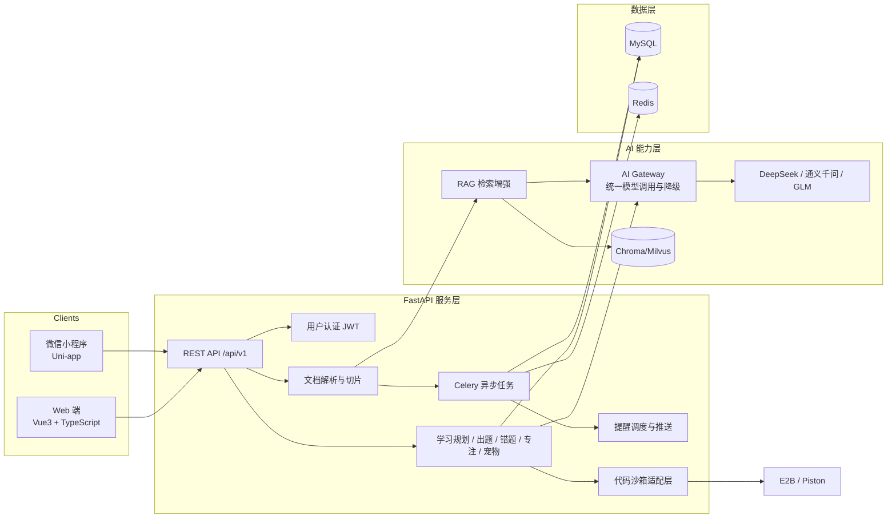
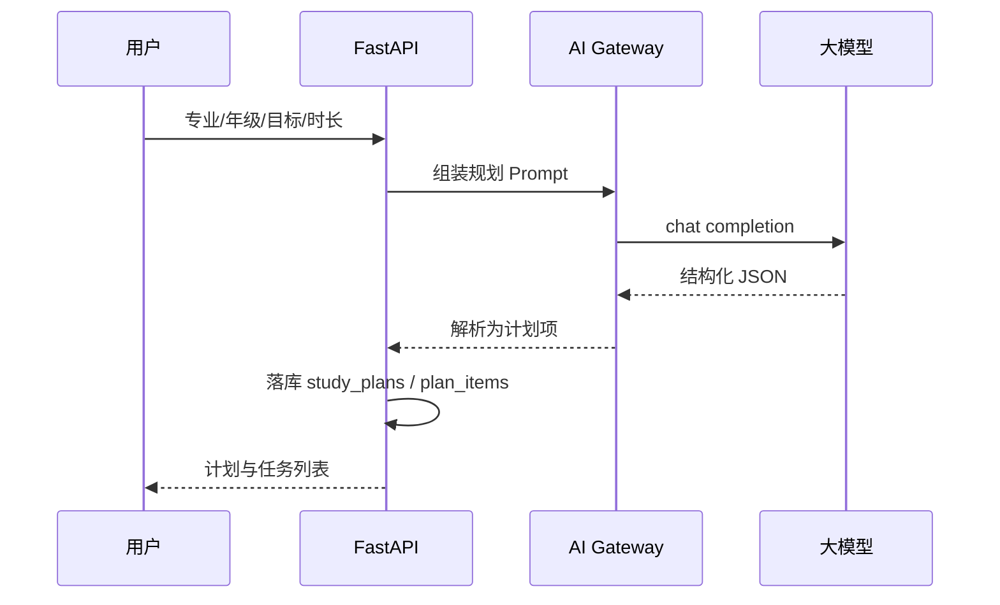
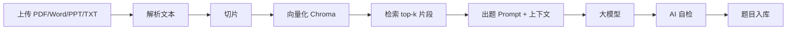
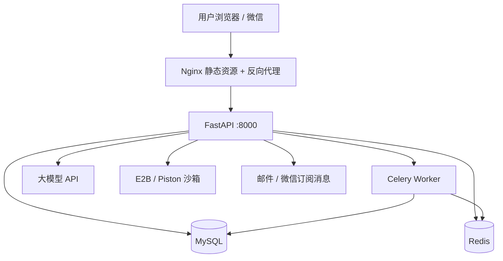

# AI智学管家 技术架构

> 本文档以 V9.0 技术架构为基准。V8.0 中更全面的功能设计（学情画像、知识标签、四重质检、复习调度、宠物经济、交互式文档出题等）已在 V9.0 框架内吸收，逐项对照见 [FEATURE_RECONCILIATION.md](./FEATURE_RECONCILIATION.md)。

## 1. 架构总览



## 2. 分层说明

### 用户层

- **Web 端**：Vue3 + TypeScript + Vite，Pinia 管理状态，Vue Router 管理路由。
- **移动端**：Uni-app + Vue3 + TS，一套代码编译到微信小程序与 H5。

### 服务层

- **FastAPI**：提供 REST API，SQLAlchemy 2.x ORM，Pydantic v2 校验。
- **MySQL**：业务主存储。
- **Redis**：缓存、Celery broker/backend。
- **Celery**：文档解析、向量化、批量出题等异步任务。

### AI 能力层

- **AI Gateway**：统一 `chat` / `generate_json` 接口，维护 provider 注册表（DeepSeek / 通义千问 / GLM），支持模型路由与失败降级。
- **RAG Engine**：文档解析 → 文本切片 → Chroma 向量化 → 相似度检索 → 上下文注入 Prompt。
- **出题质量管道**：RAG 约束 → AI 自检 → 格式规则校验 → 用户反馈，四重质检闭环。
- **复习调度**：错题按 1/3/7/15/30 天进入今日任务，配合知识标签实现跨知识点复习。
- **提醒与推送**：Celery Beat 定时检查任务状态，通过站内通知/邮件/微信订阅消息推送。
- **公开课程聚合**：仅维护课程索引、章节映射与外链跳转，作为出题的“教材”参考。
- **代码沙箱适配层**：统一封装 E2B / Piston 等成熟服务，不重复开发底层隔离设施。
- **Prompt 管理**：规划、出题、自检、举一反三等 Prompt 集中放在服务层，方便迭代。

## 3. 关键设计决策

| 决策 | 选择 | 理由 |
| --- | --- | --- |
| 后端框架 | FastAPI | 异步友好、Pydantic 校验、自动 OpenAPI 文档 |
| ORM | SQLAlchemy 2.x | 成熟稳定，迁移成本低 |
| 向量库 | Chroma（本地），Milvus（扩展） | 演示环境轻量，后续可平滑替换 |
| RAG 管理 | 薄封装 + LlamaIndex 可选 | 先控制复杂度，必要时再引入 LlamaIndex |
| 模型接入 | OpenAI 兼容 HTTP 接口 | DeepSeek/通义/GLM 均提供兼容端点，统一协议 |
| 降级策略 | 多模型切换 + 明确报错 | AI 不可用时返回 502，不生成模板内容 |
| 初始化 | create_all + Alembic 双轨 | 开发期快速建表，生产走迁移 |
| 数据隔离 | user_id 逻辑隔离 | 不引入多租户 Tenant ID，保持 V9.0 轻量化架构 |
| 代码沙箱 | 接入 E2B / Piston | 避免重复开发底层安全设施，不引入 K8s |
| 知识图谱 | 四级标签体系 | 用学科/章节/知识点/标签实现轻量联动，不引入图数据库 |

## 4. 核心数据流

### AI 学习规划



### 文件智能出题



## 5. 部署架构（演示环境）



服务器：2 核 4G 云服务器，Docker Compose 编排。

## 6. 代码目录

```text
AI学习平台/
├── docs/                 # 开发计划与架构文档
├── backend/              # FastAPI 后端
│   ├── app/
│   │   ├── api/          # 路由与依赖
│   │   ├── core/         # 配置、数据库、安全
│   │   ├── models/       # SQLAlchemy 模型
│   │   ├── schemas/      # Pydantic 模型
│   │   ├── services/     # AI Gateway、RAG、业务服务
│   │   └── tasks/        # Celery 任务
│   ├── alembic/          # 数据库迁移
│   └── tests/            # 后端测试
├── web/                  # Vue3 + TS Web 端
├── mobile/               # Uni-app 小程序端
└── docker-compose.yml    # MySQL/Redis/后端编排
```
