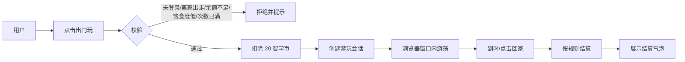

# AI宠物“出门玩”功能开发文档

> 面向功能迁移：本文档拆解“出门玩”功能的设计、数据模型、API、核心逻辑、前端交互与移植步骤，可直接用于其他项目复刻。
> 版本：V1.0，日期：2026-08-09

## 1. 功能概述

“出门玩”是 AI 宠物的限时游荡玩法：用户点击“出门玩”后，宠物会在浏览器窗口内散步、跑动、跳跃，并消耗智学币，换取心情与经验，同时降低饱食度。

范围约束：

- 仅在桌面 Web 端实现，移动端/小程序端不支持。
- 以 V9.0 技术架构为基准：Vue3 + TypeScript Web 端、FastAPI 后端、SQLite/MySQL 数据库。
- “出门玩”属于游戏化互动，不依赖 AI 生成回复；AI 不可用时不影响出门玩流程。

## 2. 玩法与数值设计

### 2.1 单次出门玩配置

| 配置项 | 数值 | 说明 |
| --- | --- | --- |
| 智学币消耗 | 20 | 开始游玩时立即扣除 |
| 游玩时长 | 15 分钟 | 前端倒计时展示，以服务器时间为准 |
| 心情增加 | +15 | 正常结束时全额结算 |
| 经验增加 | +20 | 正常结束时全额结算 |
| 饱食度降低 | -15 | 正常结束时全额结算 |
| 每日上限 | 5 次 | 按用户本地时区“自然日”统计 |
| 最低饱食度 | 20 | 低于该值不允许出门 |

### 2.2 收益对比

| 行为 | 智学币 | 心情 | 经验 | 饱食度 |
| --- | --- | --- | --- | --- |
| 普通饲料 | -10 | +5 | +10 | +25 |
| 高级营养膏 | -50 | +12 | +50 | +45 |
| 出门玩 | -20 | +15 | +20 | -15 |

“出门玩”的经验收益与普通饲料持平，心情收益更高，并消耗饱食度，形成“玩 → 饿 → 喂食 → 再玩”的消耗闭环。

## 3. 业务流程



## 4. 数据模型

### 4.1 pets 表扩展

| 字段 | 类型 | 说明 |
| --- | --- | --- |
| play_date | date | 最近一次出门玩的自然日，用于每日上限统计 |
| play_count_today | int | 今日已出门玩次数 |
| playing_until | datetime | 当前游玩会话的结束时间，无会话时为 NULL |

### 4.2 新增 pet_play_sessions 表

| 字段 | 类型 | 说明 |
| --- | --- | --- |
| id | int PK | 会话 ID |
| pet_id | int FK | 关联 pets.id |
| status | string | active / completed |
| started_at | datetime | 开始时间 |
| ended_at | datetime | 结束时间 |
| duration_minutes | int | 计划时长（15） |
| coin_cost | int | 消耗智学币（20） |
| mood_gain | int | 心情收益（15） |
| exp_gain | int | 经验收益（20） |
| hunger_loss | int | 饱食度消耗（15） |
| created_at | datetime | 创建时间 |

### 4.3 智学币流水

扣费沿用 `coin_transactions` 表，`reason = "出门玩"`，金额为 `-20`，便于账本展示与审计。

## 5. API 设计

| 方法 | 路径 | 说明 |
| --- | --- | --- |
| POST | /pets/{pet_id}/play-out | 开启出门玩会话 |
| GET | /pets/{pet_id}/play-session | 查询当前活动会话，用于刷新恢复 |
| POST | /pets/{pet_id}/play-out/end | 结束会话，正常结束或提前回家 |

### 5.1 开启会话

`POST /pets/{pet_id}/play-out`

校验顺序：

1. 宠物存在且属于当前用户
2. 未离家出走
3. 当前没有活动会话
4. 饱食度 >= 20
5. 智学币 >= 20
6. 今日出门次数 < 5

成功响应：

```json
{
  "session": {
    "id": 1,
    "status": "active",
    "started_at": "2026-08-09T08:00:00",
    "playing_until": "2026-08-09T08:15:00",
    "duration_minutes": 15,
    "coin_cost": 20,
    "mood_gain": 15,
    "exp_gain": 20,
    "hunger_loss": 15
  },
  "pet": {
    "id": 1,
    "name": "小智",
    "mood": 100,
    "hunger": 85,
    "exp": 0,
    "play_count_today": 1
  }
}
```

### 5.2 查询活动会话

`GET /pets/{pet_id}/play-session`

- 有活动会话：返回会话详情与剩余时间
- 无活动会话：返回 `null`
- 会话已过期但未结算：后端先自动结算，再返回 `null` 与结算摘要

### 5.3 结束会话

`POST /pets/{pet_id}/play-out/end`

- 正常到时结束：全额结算
- 提前回家：按实际游玩时长比例结算，向下取整
- 已结束的会话重复调用：直接返回已结束结果，保证幂等

响应包含结算摘要：

```json
{
  "message": "小智玩得很开心",
  "summary": {
    "mood_gain": 15,
    "exp_gain": 20,
    "hunger_loss": 15,
    "coins_spent": 20
  },
  "pet": {
    "id": 1,
    "mood": 100,
    "hunger": 85,
    "exp": 20,
    "play_count_today": 1
  }
}
```

## 6. 后端核心逻辑

### 6.1 开启会话

事务内完成：

1. 查询宠物并刷新状态
2. 执行 5.1 的校验
3. 扣费并写入 `coin_transactions`
4. 更新 `pets.play_date`、`play_count_today`、`playing_until`
5. 写入 `pet_play_sessions`，status = active
6. 提交事务

### 6.2 结算规则

| 场景 | 结算方式 |
| --- | --- |
| 正常到时结束 | 心情 +15、经验 +20、饱食度 -15 |
| 提前回家 | 按实际分钟数 / 15 的比例，向下取整 |
| 页面关闭后再次访问 | 服务器发现 `playing_until` 已过期，按全额结算 |

实际游玩时长取 `min(计划时长, now - started_at)`，最短按 1 分钟计。

### 6.3 并发与幂等

- 开启接口要求“当前无活动会话”，避免连点两次扣两次钱。
- 结束接口以会话状态为锁：只有 `status = active` 的会话才执行结算，重复调用直接返回。
- 多标签页看到同一会话，任一标签页调用结束后，其余标签页返回已结束状态。

### 6.4 跨天与统计

- 每日上限按 `pets.play_date` 与 `pets.play_count_today` 统计。
- 跨天时重置 `play_count_today = 0`，`play_date = 今天`。
- 会话跨零点仍按开始时的日期计入次数。

## 7. 前端交互

### 7.1 宠物页

1. 未游玩时显示“出门玩”按钮。
2. 点击后调用开启接口，成功后宠物页显示倒计时与“回家”按钮。
3. 倒计时归零自动调用结束接口，并弹出结算气泡。
4. 点击“回家”提前结束，按比例结算。

### 7.2 浮动宠物

- 开启“出门玩”后，浮动宠物自动显示并进入 roaming 状态。
- roaming 状态比 idle 更活跃：底部散步、随机跑动、偶尔跳跃挥手。
- 游玩中拖拽宠物不受影响；结束或回家后回到 idle。
- 刷新页面时通过 `GET /play-session` 恢复倒计时与 roaming 状态。

### 7.3 提示与气泡

- 校验失败提示：余额不足、饱食度太低、今日次数已满、正在游玩中、离家出走。
- 结算气泡示例：`玩得好开心，心情 +15，经验 +20，饱食度 -15`
- 前置状态反馈使用本地文案，不调用 AI，避免无谓消耗。

## 8. 边界与异常

- 宠物离家出走：不允许出门玩，先使用寻回卷轴。
- 饱食度低于 20：提示先喂食。
- 智学币不足：提示余额不足。
- 每日次数已满：提示明天再来。
- 页面关闭后再次访问：后端自动结算过期会话。
- 多标签页并发：结束接口幂等，不会重复结算。
- 时钟修改：结算只以服务器时间 `playing_until` 为准。
- 移动端/小程序：不提供“出门玩”入口。

## 9. 测试计划

### 9.1 后端测试

- 开启成功：扣费、次数 +1、创建 active 会话
- 余额不足：返回 400，不扣费
- 饱食度不足：返回 400
- 离家出走：返回 400
- 每日上限 5 次：第 6 次返回 400
- 正在游玩中重复开启：返回 400
- 提前结束：按比例结算
- 正常到时结束：全额结算
- 过期会话自动结算：查询接口返回结算摘要
- 重复结束：幂等
- 跨天重置次数

### 9.2 前端测试

- 按钮状态：可出门 / 游玩中 / 次数已满
- 倒计时展示与归零自动结束
- 刷新后恢复会话
- 提前回家结算提示
- 浮动宠物 roaming 状态与结算气泡

## 10. 迁移与部署

- 新增 Alembic 迁移：扩展 `pets` 表并创建 `pet_play_sessions` 表。
- 不需要新增外部服务，沿用现有 FastAPI + SQLite/MySQL。
- 无 AI Key 也可完整使用“出门玩”，不影响演示。
- 不修改小程序端代码。

## 11. 开发任务拆解

1. 后端：数据模型与迁移
2. 后端：开启/查询/结束接口与每日上限、并发校验
3. 后端：结算逻辑与幂等
4. 后端：测试用例
5. Web：宠物页“出门玩”按钮、倒计时、回家
6. Web：浮动宠物 roaming 状态
7. Web：结算气泡与刷新恢复
8. 收尾：文档更新、构建验证、推送
