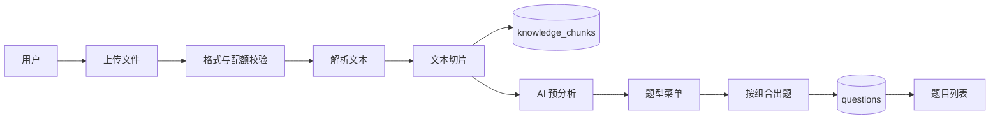
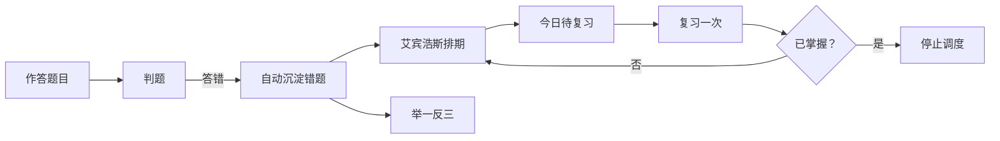

# 文件出题与错题本 功能开发文档

> 面向功能迁移：本文档拆解“文件出题”和“错题本”两个功能的设计、数据模型、API、核心逻辑、前端交互与移植步骤，可直接用于其他项目复刻。
> 版本：V1.0，日期：2026-08-08

## 1. 功能概述

### 1.1 文件出题

用户上传学习资料（PDF / Word / PPT / TXT），系统解析文本、切片入库，再由 AI 基于文档内容生成题目。支持两种方式：

1. 快速出题：指定题型和数量，直接基于文档生成。
2. 交互式出题：先由 AI 分析文档，返回知识点数量、内容完整度和推荐题型菜单，用户调整各题型数量后按组合生成。

### 1.2 错题本

用户作答 AI 题目后，答错的题目自动沉淀到错题本，并按艾宾浩斯遗忘曲线安排复习（1/3/7/15/30 天）。支持复习打卡、标记掌握、举一反三和题目收藏/删除。

## 2. 文件出题

### 2.1 业务流程



### 2.2 数据模型

| 表 | 关键字段 | 说明 |
| --- | --- | --- |
| documents | id, user_id, filename, file_type, storage_path, status, chunks_count, size_bytes, temp_cleanup_at, created_at | 上传文档元数据 |
| knowledge_chunks | id, document_id, chunk_index, content, metadata_json, vector_id | 解析后的文本切片 |
| file_analyze_results | id, document_id, menu_json, message, created_at | AI 预分析结果，每文档一条 |
| questions | id, user_id, document_id, subject, knowledge_point, question_type, stem, options_json, answer, analysis, source, is_favorite, created_at | 生成题目 |

### 2.3 API 设计

| 方法 | 路径 | 说明 |
| --- | --- | --- |
| POST | /files/upload | 上传文件（multipart/form-data），校验格式、数量与大小 |
| GET | /files | 当前用户文档列表 |
| POST | /files/{id}/parse | 解析文本并切片入库 |
| POST | /files/{id}/analyze | AI 预分析，返回题型菜单 |
| POST | /files/{id}/questions | 生成题目，支持单题型或题型组合 |

上传限制：

- 允许格式：pdf、docx、pptx、txt、md、png、jpg、jpeg
- 单个用户最多同时保存 5 个文件
- 总大小不超过 50MB
- 临时文件默认 7 天后清理（Celery 定时任务）

### 2.4 核心实现

#### 文档解析

按文件类型调用对应解析器：

- PDF：`pypdf.PdfReader`，逐页提取文本
- Word：`python-docx`，读取段落文本
- PPT：`python-pptx`，遍历形状文本
- TXT/MD：直接读取 UTF-8 文本
- 图片：预留 OCR 接口，当前未启用，解析时返回“不支持”

#### 文本切片

按段落聚合，切片大小默认 800 字符、重叠 100 字符，避免知识被切断。

#### AI 预分析

将文档切片作为上下文，让 AI 返回结构化 JSON：

```json
{
  "knowledge_points": 5,
  "completeness": "rich",
  "message": "已分析文档内容",
  "menu": [
    { "question_type": "choice", "count": 5 },
    { "question_type": "fill", "count": 2 },
    { "question_type": "short_answer", "count": 1 }
  ]
}
```

AI 不可用时回退到规则菜单：选择题数量跟随切片数、固定 2 道填空、1 道简答。

#### 出题 Prompt 约束

- 只输出 JSON 数组，不要解释或 Markdown
- 每题包含：subject、knowledge_point、question_type、stem、options、answer、analysis
- 有文档上下文时仅基于资料出题，降低幻觉

#### 题型组合

`question_plan` 示例：

```json
{
  "question_plan": [
    { "question_type": "choice", "count": 2 },
    { "question_type": "fill", "count": 1 }
  ]
}
```

后端循环生成并按类型合并返回。

### 2.5 前端交互

Web 文件页流程：

1. 选择文件并上传
2. 点击“解析”
3. 点击“AI 分析”，展示题型菜单
4. 调整各题型数量
5. 点击“按此组合出题”，题目显示在下方列表

复用组件：`QuestionCard` 展示题目，支持答题、解析查看；在练习列表场景下可开启收藏/删除按钮。

### 2.6 边界与异常

- 图片 OCR 未实现，上传图片后解析会提示失败
- 单文件页数限制、内容安全审核、联网搜索补全为后续增强
- AI 出题失败时自动回退模板题，保证接口不中断

## 3. 错题本

### 3.1 业务流程



### 3.2 数据模型

| 表 | 关键字段 | 说明 |
| --- | --- | --- |
| questions | id, user_id, subject, knowledge_point, question_type, stem, options_json, answer, analysis, is_favorite | 题目 |
| answer_records | id, user_id, question_id, user_answer, is_correct, spent_seconds, created_at | 作答记录 |
| wrong_book_items | id, user_id, question_id, mistake_reason, review_count, mastered, review_stage, next_review_date, last_reviewed_at, created_at | 错题与复习调度 |

### 3.3 API 设计

| 方法 | 路径 | 说明 |
| --- | --- | --- |
| POST | /questions/{id}/answers | 提交作答并判题 |
| GET | /wrong-book | 错题列表 |
| GET | /wrong-book/review | 今日待复习错题 |
| PATCH/PUT | /wrong-book/{id} | 复习一次或标记掌握 |
| POST | /questions/generate | 举一反三（按知识点重新出题） |
| PATCH/PUT | /questions/{id}/favorite | 收藏/取消收藏 |
| DELETE | /questions/{id} | 删除题目并清理关联数据 |

### 3.4 核心逻辑

#### 判题

| 题型 | 规则 |
| --- | --- |
| 单选题 | 去除首字母后与答案前缀比较 |
| 填空题 | 答案与提交内容互相包含 |
| 简答题 | 提取关键词后计算重合率，阈值 50% |

简答题为关键词评分，AI 智能判题为后续增强。

#### 自动沉淀

答错后自动创建错题记录：

- `review_stage = 1`
- `next_review_date = 今天 + 1 天`
- 记录错误答案作为 `mistake_reason`

#### 艾宾浩斯排期

复习间隔：1 天 → 3 天 → 7 天 → 15 天 → 30 天。

每次“复习一次”：

1. `review_count + 1`
2. 未掌握时 `review_stage + 1`（最多 5）
3. 按新阶段计算下次复习日期
4. 标记掌握后停止调度

“今日待复习”条件：未掌握且 `next_review_date <= 今天`。

#### 举一反三

以错题的知识点重新调用出题接口，生成 3 道同类题，强化薄弱知识点。

#### 收藏与删除

- 收藏：修改 `questions.is_favorite`
- 删除：删除题目时同步清理该题的 `answer_records` 和 `wrong_book_items`

### 3.5 前端交互

Web 错题本页面：

1. 展示错题卡片：学科、复习次数、阶段、下次复习时间、掌握状态
2. “复习一次”：推进复习排期
3. “标记已掌握”：停止调度
4. “举一反三”：生成同类练习并展示在下方

### 3.6 边界与异常

- 简答题判分准确度有限，建议后续接 AI 判分
- 小样本下区分度等统计指标暂无意义，先记录基础字段
- 删除题目是硬删除，前端需二次确认

## 4. 迁移清单

### 4.1 后端移植

以下文件可直接复制到新项目，按需调整配置：

| 文件 | 职责 |
| --- | --- |
| services/document_parser.py | 文档解析与切片 |
| services/question_generator.py | 出题 Prompt、判题、离线兜底 |
| services/file_analyzer.py | 文档 AI 预分析 |
| api/routes/files.py | 上传、解析、分析、出题接口 |
| api/routes/questions.py | 出题、作答、错题本、收藏/删除接口 |

依赖：

```text
pypdf
python-docx
python-pptx
httpx
sqlalchemy
fastapi
```

可选：`chromadb` / `llama-index`（RAG 向量检索）。

### 4.2 前端移植

| 文件 | 职责 |
| --- | --- |
| components/QuestionCard.vue | 题目展示、答题、解析、收藏/删除 |
| views/FilesView.vue | 文件出题完整流程 |
| views/WrongBookView.vue | 错题本与举一反三 |

接口封装参考：

- `api/files.ts`：upload / parse / analyze / generateQuestions
- `api/questions.ts`：generate / setFavorite / remove / submitAnswer / wrongBook / updateWrongItem

### 4.3 数据库迁移

新项目需创建或迁移以下表：

```text
documents
knowledge_chunks
file_analyze_results
questions
answer_records
wrong_book_items
```

迁移注意：

- `documents.size_bytes` 和 `temp_cleanup_at` 需回填
- `wrong_book_items.review_stage`、`next_review_date`、`last_reviewed_at` 需设置默认值
- 所有业务表建议带 `user_id` 并建立索引，保证数据隔离

### 4.4 配置与环境变量

```dotenv
UPLOAD_DIR=uploads
VECTOR_DB_DIR=vector_db
AI_PROVIDER=deepseek
DEEPSEEK_API_KEY=
```

### 4.5 测试验收

迁移后建议跑通以下场景：

1. 上传 TXT/PDF → 解析 → 切片成功
2. 调用 AI 分析返回题型菜单
3. 按组合生成题目，题型数量正确
4. 答错自动进错题本，阶段 1、次日复习
5. 复习一次后阶段 2、3 天后复习
6. 删除题目后错题记录同步清理
7. 无 AI Key 时全部功能使用离线兜底，不中断

## 5. 后续增强

- 图片 OCR 与联网搜索补全
- AI 简答题判分
- 单文件页数限制、内容安全审核
- 教育测量学统计（难度系数、区分度）
- 文档删除接口与文件生命周期管理完善
